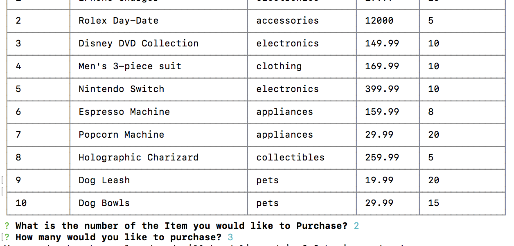
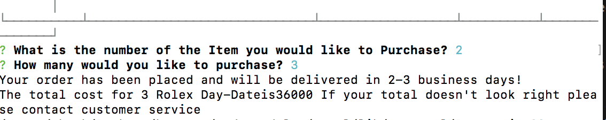

## BAMAZON Application

- The BAMAZON application is an application that uses SQL database and the NODE console interface to allow you to check inventory and buy products.

## Installs Required

Since the Application runs on nodeJS there are packages that need to be installed to the root folder in order for this application to work.

- INQUIRER Package

  - The inquirer package allows you to prompt users and interact with the data. To install this package go to your root folder in the console and type in npm i inquirer

- SQL Package

  - The SQL package is necessary to respond with the data in your SQL database. To install this package go to your root folder and type in npm i mysql

- CLI-BOX Package
  -The CLI-BOX package allows the user to put the information from their database into a nice neat box that you can adjust the columns on. You can install this by going to your root folder and typing in npm i cli-box

## Running the Application

- Once all the required packages are installed into the root folder you are ready to run the Bamazon application.

- Start by typing in node bamazon.js to run your javascript. This will bring up the CLI-BOX that holds the information from the database. It Will also run the prompt that asks Which Item ID you are interested in.

- Once you type in a number it then asks you how many of the item you have chosen you want.

-After entering the quantity in, the app will show your total and tell you that you have ordered said items and also update the database.

